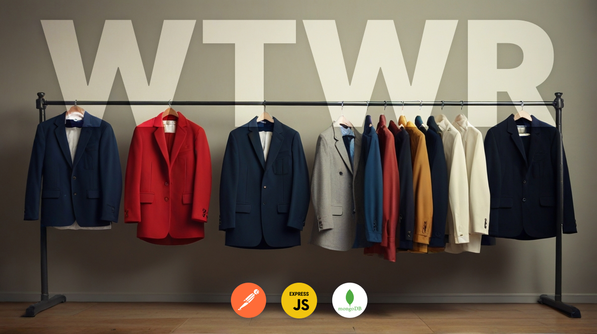

# WTWR (What to Wear?) — Backend
The back-end for the WTWR application https://wtwr.xyz — weather-appropriate clothing app.

## Technologies
* Node.js + Express
* MongoDB + Mongoose
* Bcrypt to ensure secure storage of passwords
* JWT (JSON Web Tokens) for authenticating and authorizing users
* REST API

## Deployment
* AWS (Amazon Web Services)
* NGINX to manage traffic
* Certbot to provide secure communication

